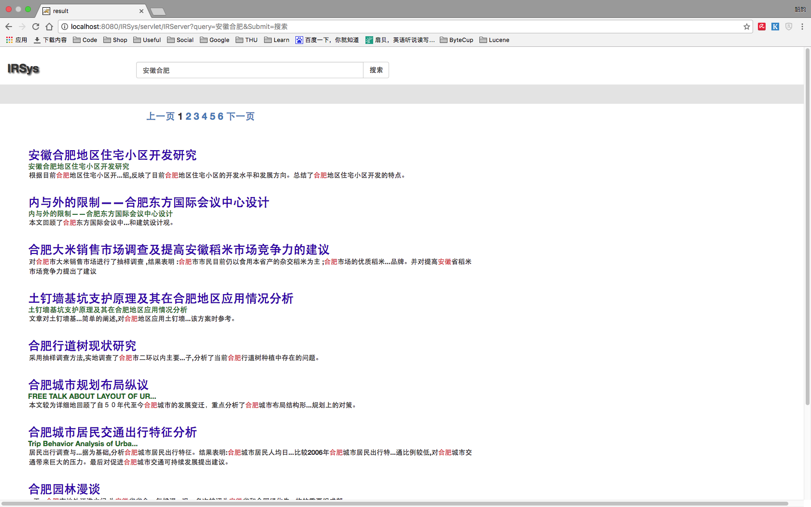
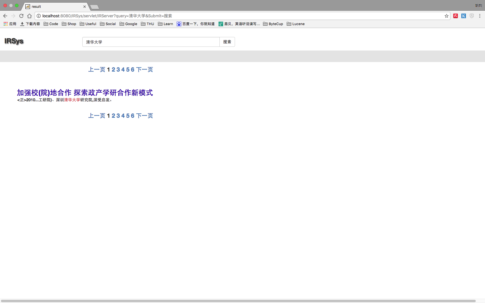
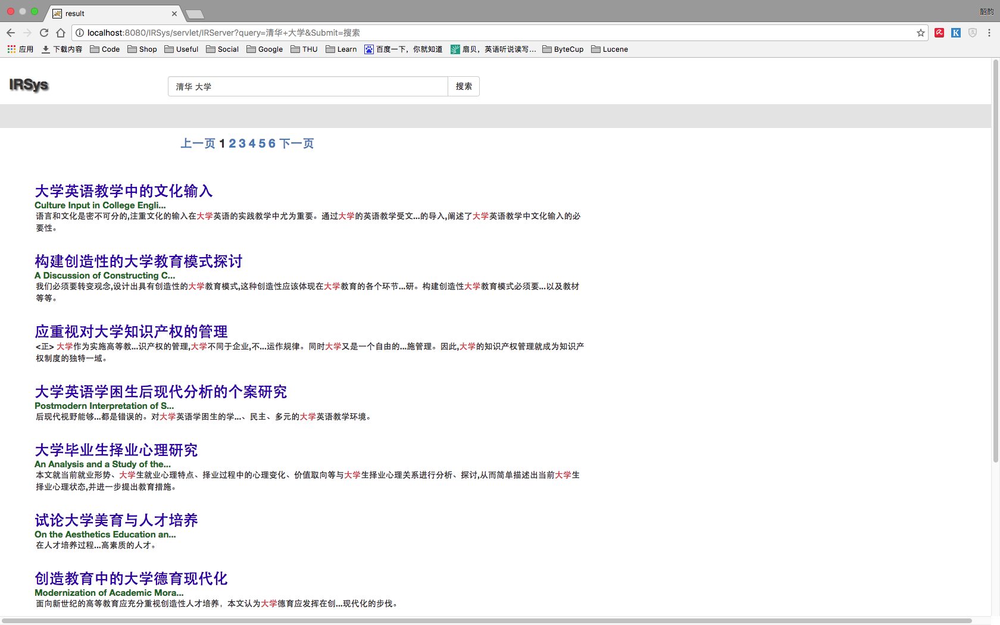

# 《信息检索》大作业 Part1 实验报告

*施韶韵 计34 2013011358*

## 实验步骤

### 分词器

选择了`Ansj`中文分词器，因为它较优于`IKAnalyzer`且带有Lucene插件  
也配置了`IKAnalyzer`但是测试没有`Ansj`好  
Ansj GitHub: `https://github.com/NLPchina/ansj_seg`

### 建立索引

逐行读取数据文件，每碰到一个`<REC>`标签则新建一个`Document`  
接下来每行将`=`左右分开，左边去掉尖括号后作为`Field`名称，右边作为`Field`内容加入`Document`  
最后将`Document`加入`IndexWriter`中  
代码属于`IRIndexer.java`

### 建立查询

使用`MultiFieldQueryParser`对多个`Field`进行查询  
目前只对`题名`、`英文篇名`、`摘要`、`英文摘要`进行查询，通过`boosts`参数将权重设为`10:10:5:5`  
代码属于`IRSearcher.java`

### 部署Tomcat

安装`Tomcat`，并在Eclipse中新建`Server`，并配置好各参数  
创建网页和`Server`代码使其可运行在`Tomcat`上  
在`Server`代码中处理`Get`请求  
将`Searcher`返回的结果提取出`题名`、`英文篇名`、`摘要`，返回至前端  

### 前端

主页设为`http://localhost:8080/IRSys/search.jsp`  
搜索结果界面为`show.jsp`  
使用`Bootstrap`等美化前端

## 实例结果分析

### 安徽合肥

首先出现的是标题中既有“安徽”又有“合肥”的文档，然后才是只出现了“安徽”、“合肥”的文档，这是合理的因为更接近Query。  
有些文档的“英文篇名”还是中文，而它和“题名”权重一样且大于“摘要”，所以在英文标题中同时搜到“安徽”或“合肥”的同样很靠前。  
可以明显感觉到所设置的“题名”、“英文篇名”、“摘要”之间的权重差异，相对合理。

### 清华大学

第一个搜索“清华大学”中“清华”和“大学”之间没有空格，第二个有。可见搜索结果有明显差异。  
因为第一个分词器不会把它拆开，“清华大学”作为一个完整的词在索引中进行查询，查到的结果也非常精准。  
而拆开后将分别查询“清华”和“大学”，此时包含“大学”的文档就很多很多了。  
结果有其不合理之处，比如个人认为此时同时出现“清华”和“大学”的文档应该是比较重要的即第一张图的搜索结果，但是在索引建立过程中第一个“清华大学”没有被分开，所以该文档是不会被查询到的。

## 分词粒度分析

### 1-gram

即按字建立索引，这样可以保证只要查询词包含相同的字就一定会被查询到，但是精准度就差的多了。  
例如搜索“清华”，搜索出来的文档都包含“清”和“华”，但是问题是这和我们实际要搜的“清华”含义相差甚远。

### N-gram

按固定的N个字为建立索引，比如bigram按两个字一组建立索引。这样似乎可以提高准确度。  
但是可能会产生大量无用的索引，比如“清华大学”中的“华大”可能是没有意义的。  
或者产生歧义，比如“大学生活”可能在查询“学生”这个词时被搜索到，显然是不对的。

### 多粒度分词

Ansj分词器有多粒度分词功能。  
比如对“上海虹桥机场南路” 分词结果是[上海/ns, 上海虹桥机场/nt, 虹桥/ns, 虹桥机场/nz, 机场/n, 南路/nr]  
这样就相对比较合理，无论你查询词是怎样的，都能得到较合理的结果。

## 工程部署

可通过Eclipse直接导入工程。  
Server使用Tomcat 7.0。  
让代码在Server上跑起来需要设置Server Location为Tomcat安装路径。Deploy Path设置为webapps。  
工程的Run Configrations里设置为工程文件目录。  
为支持中文，需将`Tomcat/conf/server.xml`中的添加`URIEncoding="utf-8"`。 

