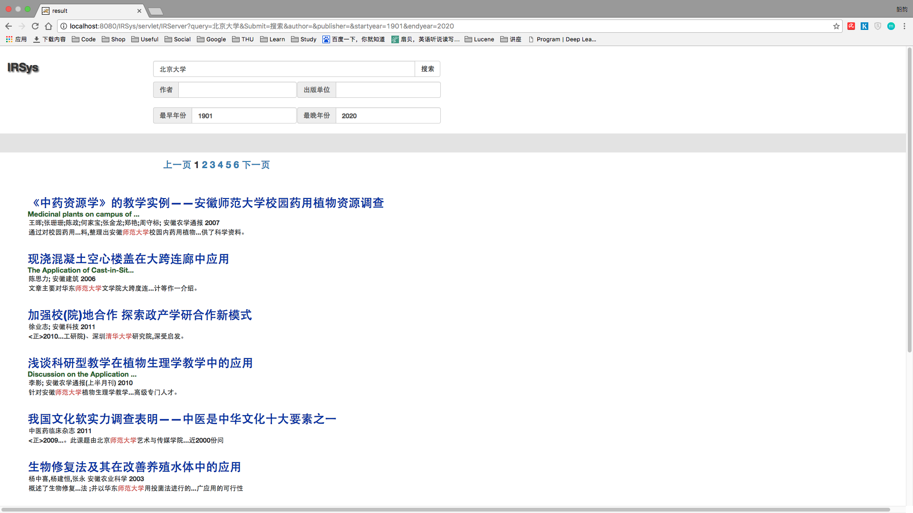
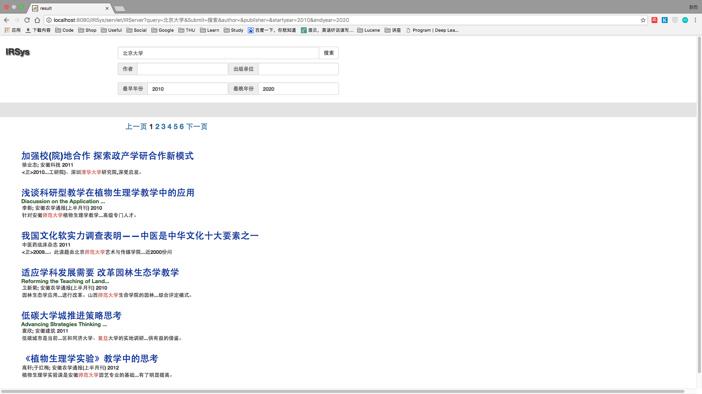
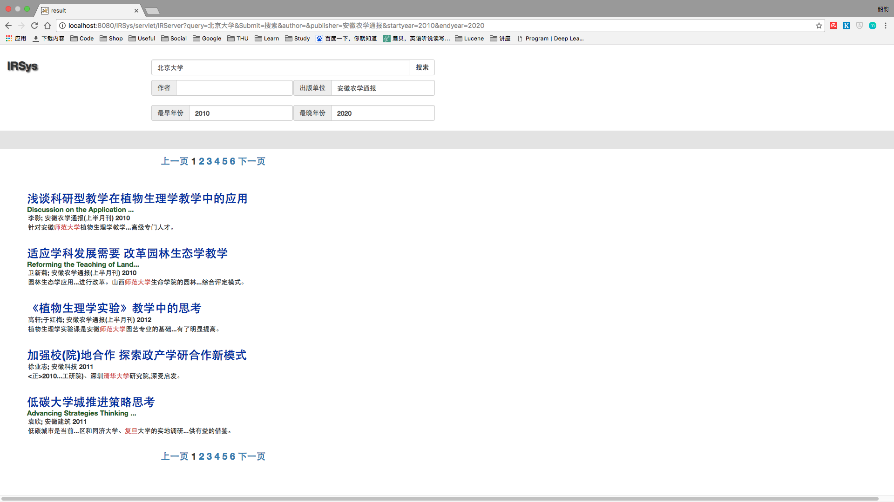
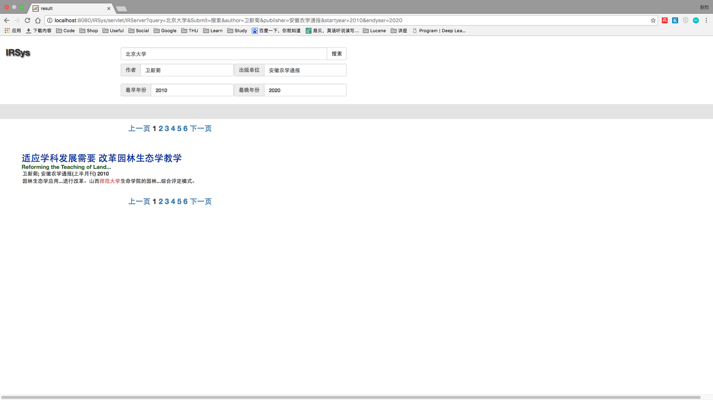

# 《信息检索》大作业 Part2 实验报告

*施韶韵 计34 2013011358*

## 实验步骤

### 前端输入

增加了几个输入框，可以输入作者、出版单位和起止年份以便查询

### 建立索引

在part1中已对所有域建立索引，此处无需更改

### 建立查询

基本的Query使用`MultiFieldQueryParser`对多个`题名`、`英文篇名`、`摘要`、`英文摘要`进行查询
其他输入条件与之用`BooleanQuery`合并，条件使用`MUST` 
代码属于`IRSearcher.java`

### 引入Word2Vec

用作业3中已训练好的`.bin`文件，使用网络上的代码载入
Word2Vec java: [GitHub Ansj Word2VEC_java](https://github.com/NLPchina/Word2VEC_java/blob/master/src/main/java/com/ansj/vec/Word2VEC.java)

### 临近词查询

对于基本的Query字符串，先进行分词
然后对每个词找到与其最近的三个词，在原Query字符串中进行替换得到新的Query字符串
对每个Query字符串使用`BooleanQuery`结合，条件使用`SHOULD`
基本的Query字符串boost为1，其他为0.5
再讲这个`BooleanQuery`与其他条件用`BooleanQuery`结合，条件使用`MUST`

## 实例结果分析

### 北京大学

因为与北京大学最近的三个词是“复旦”、“师范大学”、“清华大学”。
虽然原本“北京大学”搜索不到结果（标题和摘要中确实没有北京大学）。
但是结果可以搜索到这些词。

### 北京大学 2010-2020

可见结果只剩2010年以后的。

### 北京大学 2010-2020 安徽农学通报

可见靠前结果只剩安徽农学通报上发表的。
之后结果是类似出版单位的。

### 北京大学 2010-2020 安徽农学通报 卫新菊

可见结果只剩卫新菊发表的。
